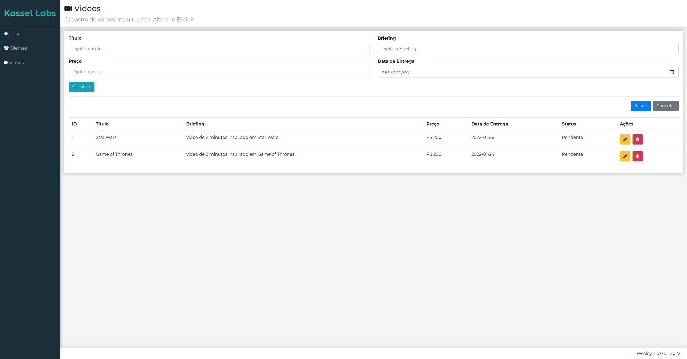

# Kassel Labs - Frontend Test

PRÉ-REQUISITOS
--------------------------------------------------
1. Para utilizar o comando npm, é necessário ter o nodejs instalado.
https://nodejs.org/en/download/

2. Instalação de dependências
```
$ cd backend
$ npm install

$ cd frontend
$ npm install
```

EXECUTANDO A APLICAÇÃO
--------------------------------------------------
```
Terminal (instância 1):
$ cd backend
$ npm run start

Terminal (instância 2):
$ cd frontend
$ npm run start
```


